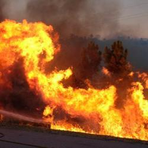
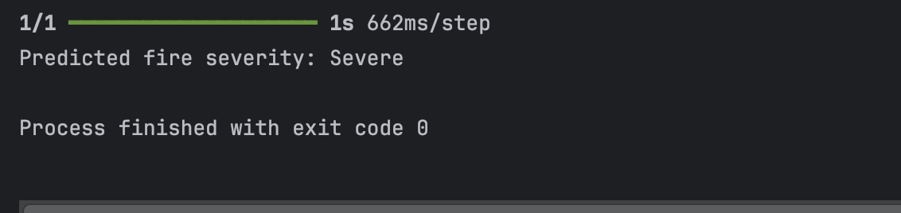
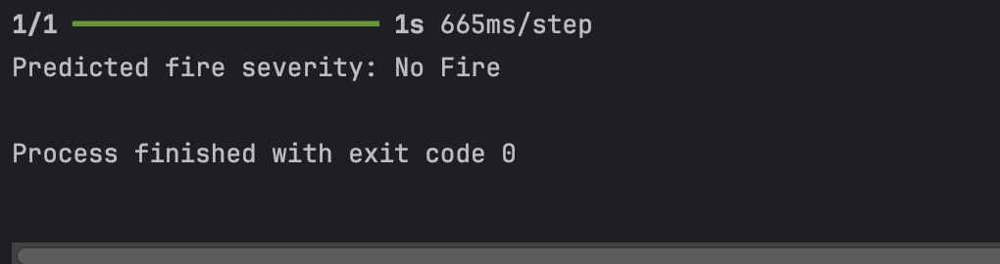
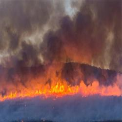

# Fire Severity Classifier Model 
Python model to classify the severity of a fire from an image

The Model classifies image into four categories fire/No_fire and fire level from low to severe.
Due to low datasets present for low and moderate fire data, the model currenlty predicts any kind of fire as Severe.

# Test result
# 1 Fire Image

# Result

# 2 No Fire Image

# Result

# 3 Fire Image

# Result

# 4 No Fire Image

# Result

